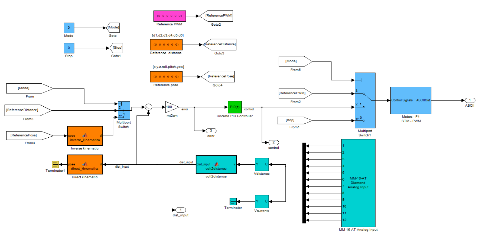
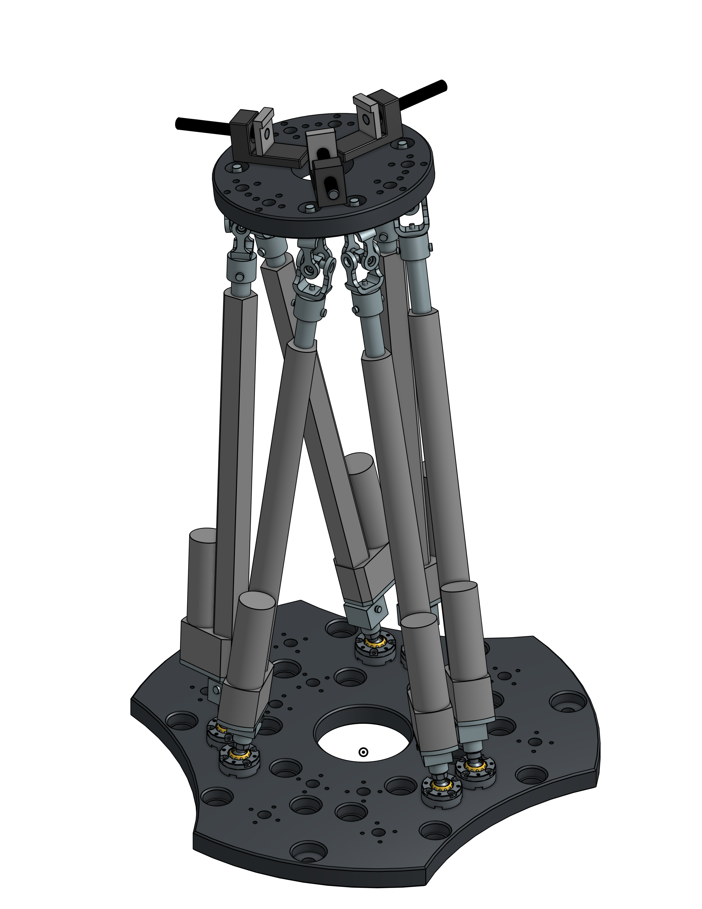
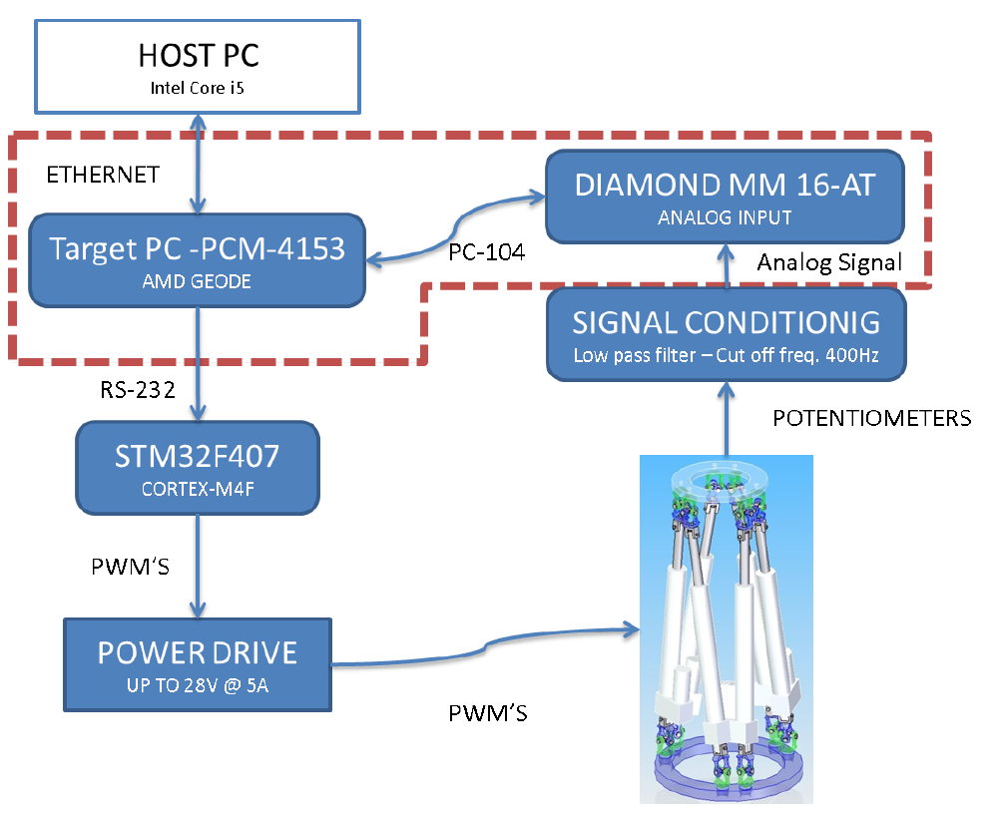

# Stewart Gough platform (Legacy system)

The mechatronic lab at Universidad Nacional de Colombia has a Stewart Gough platform, a six Degrees Of Freedom parallel manipulator powered by lineal actuators. This repo contains the legacy system used to control this robot.

<p align="center">
    
</p>

## Installation

### Requirements
* __MATLAB:__ Install an old version of MATLAB that supports XPCTarget toolbox is required. MATLAB R2011a is recommended [^matlab_downloads].   
* __xPC Target:__ Install XPCTarget toolbox version 5.0.
* __C++ compiler:__ Install C++ compiler compatible with XPC. Getting it by installing visual studio is recommended.
    ```matlab 
    xpcgetCC('supported')
    ```
    

    > Testing with various Microsoft compilers, we found that some versions of Microsoft Visual C++ are not recognized by MATLAB and are difficult to find. Therefore, the [Open Watcom](http://www.openwatcom.org/) compiler is recommended.
    > > _Note: Download the version specified by MATLAB (in R2011a, __Open Watcom version 1.8__)_.


### Set-up custom libraries
Once the required programs are installed. Get a copy of this repo and set up the custom libraries located in the _ext_ folder. 

1. Copy the folder _thirdpartydrivers_ folder into the XPC toolbox folder located at _matlabroot_. Then write the command `rehash toolbox` to update the files MATLAB toolbox is referencing.
    ```matlab
    driverSource = '..\ext\thirdpartydrivers';
    driverDestination = strcat(matlabroot,'\toolbox\rtw\targets\xpc\target\build\xpcblocks\thirdpartydrivers')
    copyfile(driverSource, driverDestination)
    rehash toolbox
    ```
1. Add to MATLAB's search path the Simulink's custom Stewart Gough library
    ```matlab
    savepath('..\ext\Stewart_Gough_library')
    savepath('..\ext\Stewart_Gough_library\Trajectories')
    savepath('..\ext\Stewart_Gough_library\Functions')
    ```

## Setup xPC Compiler
Run `xpcsetCC('setup')`  to choose from list of valid compilers and `xpcgetCC('installed')` to check the available compilers.

> The file [quickReferenceCommand](src/quickReferenceCommands.m) is a MATLAB script that contains useful commands for setting up the environment.


## Getting started


## Simulink model 



mode: controls de mode of operation of the model  
* 0: disable PWM
* 1: Pose control
* 2: Actuator distance control
* 3: manually set PWM signal control
   

block reference
* MM-16-AT Analog Input : [addiamondmm16atcustom](./ext/thirdpartydrivers/addiamondmm16atcustom.c) 


* SG-ADC Sensors: wrapper of MM-16-AT Analog Input. reordering ports and filtering and scaling.
* Motors-F4 STM - PWM
  * Baseboard Serial
  * fiforead from xpc target library 
  * sertxenablebase from xpc target library

__Signal PWM__
name s2 - s7
```If Action Subsystem6/Referece/From File1/s2```

__Signal input__ distance/current direct without wrapper 
name p1 - p12
```SG-ADC Sensors/MM-16-AT Analog Input/p1```

## Controler PID
Start by performing proportional control. the linear actuator have a range of 30 cm and the PWM goes from -100 to 100.
As a starting point a controller with kP=3 and input signal in centimeters. When there is maximum error 30 cm the PWM signal goes to 90. There is the possibility to increase kP as see fit by testing.

100=Ki*(30*n) and n=t/Ts therefore Ki=(100*Ts)/(30*t) where Ts=0.01 and a stimated t=3 that results in Ki=0.01


### Compiling c files with mex

```MATLAB
mex addiamondmm16atcustom.c
mex dadiamondmm16at_custom.c
mex dodiamond16at_custom.c
```

## PCM-4153 (Single Board Computer) files


## CAD Model
In order to better understand the operation of the platform and have the parts modeled in an open source CAD program, the model was made in OnShape, a Software-as-a-Service (SaaS) product development platform that combines CAD, built-in data management, real-time collaboration tools, and business analytics[<sup>9</sup>](#references-and-resources).

<p align="center">
    <a href="https://cad.onshape.com/documents/0fb14dbddb7adb0e8dacd4ba/w/41542f3fda26bca8164b05d2/e/ca1944bdd5da46a1797ada5e?configuration=default&renderMode=0&uiState=61f9581f168a0f2540c61bf6" target="_blank">
         <br/>
        Onshape CAD Model
    </a>
</p>

This model was built based on the design plans of Francisco Villate and the models found in the catalogs of commercial parts.


## Components:

<p align="center">
    
</p>

The previos diagram the relation between the subsystems and their interaction in the control loop.

<table style="width:80%">
<caption>Components </caption> 

<tr>
    <th> Component type </th>
    <th> Generic </th>
    <th> Custom made </th>
</tr>

<tr> <th>Electronic </th>
    <th><ul>         
        <li> Single board computer (SBC) PCM-4153.  </li>
        <li> PC104 expansion card Diamond MM 16-AT. </li>
        <li> STM32F407 microcontroller.             </li>
    </ul></th>
    <th><ul>
        <li> PC104 to STM32F4 board.</li>
        <li> STM32F4 Baseboard.     </li>
    </ul></th>    
</tr>

<tr> <th>Mechanical</th>
    <th><ul>
        <li> Actuators Firgelli Automation FA-PO-35-12-12". </li>
        <li> Spherical Joints Hephaist SRJ012C.             </li>
    </ul></th>
    <th><ul>
        <li> Base plate.       </li>
        <li> Mobile plate.     </li>
        <li> Manual press.     </li>
        <li> Universal joints. </li>           
    </ul></th>
</tr>

<tr> <th>Software </th>
    <th><ul>            
        <li> STM32F4 OS real time: ChibiOS/RT</li> 
    </ul></th>
    <th><ul>
        <li> XPC third party drivers </li>
        <li> Stewart_Gough_library   </li>
    </ul></th>
</tr>
</table>

<!-- add links to libraries -->

### (work in progress) Parties involved 
* Daniel Andres Ramirez Rodriguez 
* Edgar Bolivar
* Francisco Javier Villate Gaona
* Luis Miguel Mendez - Academic supervisor 
* Jorge Sofrony - Academic supervisor
* Juan David Muñoz 
* Juan Diego Galeano 
* Ubaldo Gracia Zaragoza
* Juan David Ramirez
* Jorge Andrés Acero - Laboratory Technician
* DIMAUN (Grupo de Trabajo en Nuevas Tecnologías Diseño, Manufactura y Automatización)


## Contributors
* Alexandra - Laboratory Technician
* Jorge Andrés Acero - Laboratory Technician
* Alvaro William Roa Gutierrez- Laboratory Technician


## References and Resources
[^matlab_downloads]: [Matlab 2011a release](https://www.mathworks.com/downloads/?release=R2011a) 

<!-- 1. [Forum xPC question](https://www.mathworks.com/matlabcentral/answers/479843-about-xpc-target-and-supproted-ioboard).
2. [MATLAB real time/xPC successor](https://www.mathworks.com/products/simulink-real-time.html?s_tid=FX_PR_info).
3. [Real time MATLAB laboratory](http://tsakalis.faculty.asu.edu/coursea/481LAB2015.pdf).
4. Frank González-Morphy (2022). [xPC Target Quick Reference Guide](https://www.mathworks.com/matlabcentral/fileexchange/6414-xpc-target-quick-reference-guide), MATLAB Central File Exchange. Retrieved January 23, 2022. 
5. [xPC target User guide Version 2](http://www.bmed.mcgill.ca/reklab/manual/common/xpc/documentation/xpc_target_ug%5B1%5D.pdf). Retrieved January 23, 2022.
6. [MATLAB Real time documentation](https://www.mathworks.com/help/pdf_doc/slrealtime/index.html).
7. [STM32 Microcontroller Support ](https://www.mathworks.com/products/hardware/stmicroelectronics.html)

9. [Onshape home page](https://www.onshape.com/en/)
10. Ramírez Rodríguez, D. (2010). Diseño de una plataforma robótica paralela de 6 dof para asistente quirúrgico en cirugías de reconstrucción cráneo-facial. \[[online](https://repositorio.unal.edu.co/handle/unal/6931)\]
11. Villate Gaona, F. (2015). Diseño y construcción de prototipo para mecanizado multiejes en materiales blandos utilizando arquitectura paralela Stewart-Gough. \[[online](https://repositorio.unal.edu.co/handle/unal/55527)\]
12. [Stewart Gough videos](https://youtube.com/playlist?list=PL1-Z9ArJBD7uetQ7_8bsNCHkSw-kKsfF8)
13. [Google drive's extended documentation folder](https://drive.google.com/drive/folders/1fW6-u03ogQynEGwKbBM8Ii7BDrmoT2iq?usp=sharing)
14. Puentes Valencia, D. (2010). Desarrollo de sistema embebido en tiempo real. \[[online](https://repositorio.unal.edu.co/handle/unal/11129)\]

15. Michael Burke (2007). (xPC File Scope Tools)[https://www.mathworks.com/matlabcentral/fileexchange/15715-xpc-file-scope-tools], MATLAB Central File Exchange. Retrieved April 5, 2022.  -->


