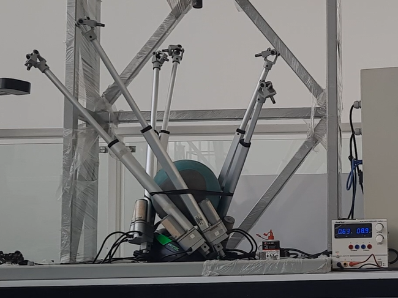
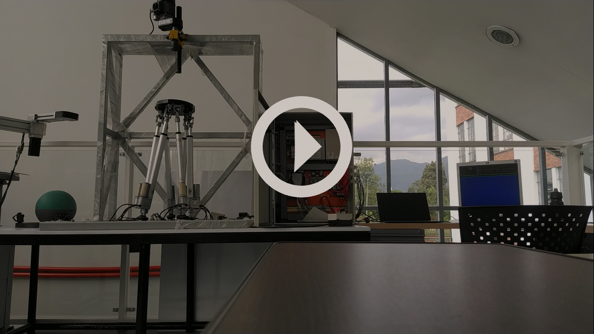
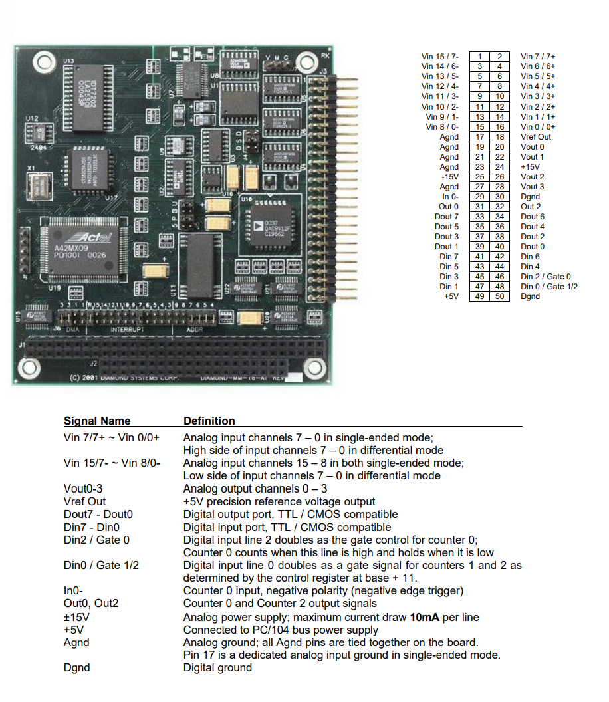
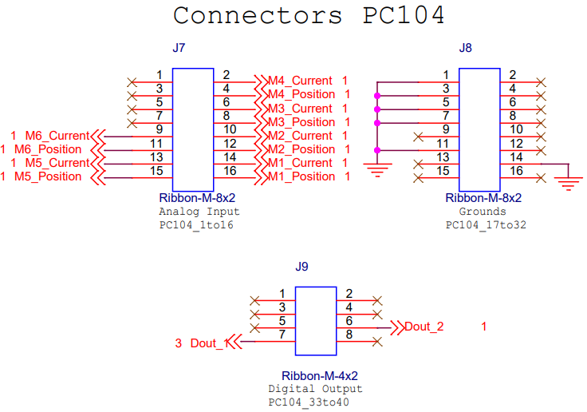
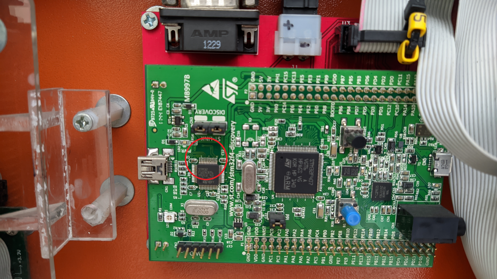
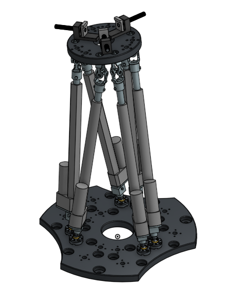

# Stewart Gough platform upkeep project 

This repo documents the diagnostic and maintenance process of the PRISMMATIC platform (Parallel Robot Interface for Simulation of Machining Multi-Axis Trajectories and Integral Control), an Stewart Gough platform at Universidad Nacional de Colombia. This work is done as part of the final project of the class _Sensors and Actuators_ Semester 2021-II. 


## Table of contents

* [Process](#process)
* [Inquires](#inquiries) 
* [Information about legacy system](#information-about-legacy-system)
* [Components](#components)
* [References and resources](#references-and-resources)

## (Tentative) Objectives
### Primary Objective
The main objective of this work is to upkeep and bring back to service the inactive PRISMMATIC platform. Recovering this asset in the mechatronic's laboratory can proof to be a useful platform for current and future students to work with parallel robots. 

### Secondary objectives
The project has the following secondary objectives:
* Document the diagnostic and maintenance process
* Update the platform and make it's system requirements compatible with a modern system (Windows 10 - MATLAB r2021a). 
* Moving the platform using open source software (Python 3.7 or higher).
* Evaluate the impact of sensor quality on the performance of the system.


## Process

### Getting to know the system
The process started by getting acquaintance with the platform. After an onsite visit of the platform, the team received the corresponding documentation and produced a [file](project_structure.txt) containing a log with every one of the files received.

```
tree /f > project_structure.txt
```
> Note: the previous terminal command produces the log file, it is encoded in windows 1252 encoding format

This analysis proof fruitful and provided a starting path *'/Software'* to begin the search.


#### Search of xPC usage
To find out how and where the xPC toolbox was used, instances of the XPCTarget toolbox were searched in the *'Software\GUI_V3'* folder. The matches found were logged in the [xpcMatch](xpcMatch.txt) file.

```
findstr /i /n /s "xpc" *.m > xpcMatch.txt
```

<!-- grep -r -n --include=\*.m 'xpc' './ENTREGA-FINAL-RC-380-2011/CONTROLADORES/PRISMMATIC/cd' > ../xpcMatch.txt

Subsystem5 -->

This information allow us to understand how and where the deprecated __xPCTarget__ library was used, identifying *./GUI_V3/BuildXPC.m:15:tgPC104 = xpctarget.xpc* as a starting point to understand the code. 


### Software setup
With an idea in mind on how the code worked. The following step consisted on setting up an environment for running it. The procedure started by following the instructions indicated in the [user manual](doc/User_Manual_StewartGoughV1_3.pdf). The legacy system requirements (MATLAB R2011a and XPCTarget toolbox 5.0) were analyzed in order to find a modern compatible setup. The xPCTarget toolbox was discontinued in MATLAB R2018a, and replaced by the __Simulink Real-Time toolbox__[<sup>1</sup>](#references-and-resources). However, this system only supports __Speedgoat__ hardware which made it incompatible for applications with the platform [components](#components). 


Therefore, MATLAB r2011a (Version 7.12), xPC target (Version 5.0) and Simulink (Version 7.7) were setup on a modern computer, which can be found at [Matlab 2011a release](https://www.mathworks.com/downloads/?release=R2011a).
> Information gathered thanks to the MATLAB command ```ver``` 


#### Installation of drivers and programs
In order for the platform's communication card to be able to connect with xPCTarget, it is necessary than the drivers from the *'\Software\thirdpartydrivers'* folder will be added to the toolbox drivers folder (*[MATLABr2011a root path]\toolbox\rtw\targets\xpc\target\build\xpcblocks\thirdpartydrivers*). Additionally, the *'Software\Stewart_Gough_library'* library needs to be added to the MATLAB path and then run `rehash toolbox` in MATLAB command window.


In order to program the single board computer PCM-4153 it is necessary to install a C compiler. Testing with several compilers we found that the version of MATLAB used only recognizes the compilers installed by __Visual Studio 2010 Professional__ (recommended software in the original documentation), this version of Visual Studio was difficult to find as an online installation did not work since Microsoft servers are unavailable, therefore, it was necessary to look for the version in the iso file (packaged with all the files necessary for installation). This program was found at the following [link](https://51-68-135-147.xyz/Getintopc.com/Visual_Studio2010_Professional_x86_x16-81637.iso?md5=m66_WqpIkGd_2yU8rFLZyg&expires=1645586596).

Once the C compiler was installed, MATLAB recognized it and proceeded with the network configuration of the card.

```
tgs = xpctarget.targets;
tgs.makeDefault('TargetPC1');
env.TargetBoot = 'DOSLoader';
env.TcpIpTargetAddress = '192.168.1.12';
env.TcpIpSubNetMask = '255.255.255.0';
```
> The first two lines are very important because they define the default target that the toolbox will use and if it is not configured correctly, some commands will probably throw errors when using them. To confirm that the correct target is configured, the `tg.getTargetNames` command can be used to view the names of the installed targets.

The next step is to set the IP address of the host PC to 192.168.1.13 with subnet mask 255.255.255.0. Finally, to move the platform, run the **GUI_V3.m** file from the *'Software\GUI_V3'* folder.


### Testing the connection
When the first connection to the platform was attempted in the lab, the code returned several errors. The first one was "wrong IP address" and the xpctarget.xpc object could not be created in MATLAB; reviewing the documentation we found that the definition `tg =  xpctarget.xpc()` produced an error if a default target had not been specified correctly, so the following command explicitly starting the settings of the target was used:

```
tg =  xpctarget.xpc('TCPIP','192.168.1.12','22222')
```

With this command the connection was established and then the GUI was executed, but it produced the error "application not loaded", and therefore, we decided to investigate in the **BuildXPC.m** file where a little more information was found.

Two useful commands we found to handle the connection to the target were
```
tg.targetping
tg.Application
```

The first shows us if the host PC and the target are on the same network without the need to check from CMD; and the second shows us which application is loaded on the target.

Finally, with the connection established it was possible to load the application that was in the **BuildXPC.m** file and connect the GUI with the target through the next commands:
```
tg.load('Code2XPCtarget\GUI_User_V1_3')
tg.start
```


### Platform troubleshooting
Initially, when we tried to manually move the platform using the pushbuttons integrated in the PC104 to STM32 board, these did not work, therefore, we decided to dismount the board out from the electrical panel, remove the drivers and check continuity between its pins using the schematic as a reference. When checking the connections, we observed that two tracks of the PCB were raised and one of them was broken. With the help of the lab technician [Alexa](#contributors) the mechatronics lab, who repaired the PCB, by a process involving cleaning it with isopropyl alcohol, inspecting the soldering points and repairing the damaged traces (Concerns about old flux were raise, where do to wear the board might present a short circuit).

The following table displays the two problematic traces before and after the repair

| PC104 to STM32F4 Board | Top view | Bottom view |
| :------- | :----: | :----: |
| Received |  |  | 
| Repaired |  |  | 

With the board repaired, we connected 1 driver and 1 of the motors and the connections from the STM32 and the PC 104 boards. Once we turn on the power we saw both lEDs in the driver turn on. This LEDs turn out to indicate the direction the motor was being energized, on LED indicate move forward and the other backwards. This in turn means that board was receiving contradictory signals producing a current overload.  At the time we weren't aware of the meaning of the driver's LEDs so we assumed the board had been repaired, as every time we power it on the motor made a little move.

<link rel="stylesheet" href="https://www.w3schools.com/w3css/4/w3.css">

<p align="center" width="60%">
     <br/>
    <div class="w3-panel w3-red">
        <h3>Warning:</h3>
        <p>Turn off immediately if both LEDs of the driver are ON  </p>
    </div> 
</p>

We then tested connecting 3 drivers and 3 motors.  This produced a greater current overload which broke again one of the tracks. With the help of the lab technician Alexa we repaired the PC104 to STM32 Board. Meanwhile we follow the suggestion of the lab technician [William](#contributors) who suggested testing and checking the motors directly without tacking into account the electronic part, in order to  first discard the possibility of a malfunctioning in any of the actuators. We disassemble the top platform and began mechanical check-up of each of the motors.

#### Mechanical Check-up
To rule out mechanical failures in the platform, each actuator was disassembled from the top platform to release the loads of each one, then each one was powered directly to power supply.
<p align="center">
    
</p>

At the time of testing each actuator, we found that for a forward voltage of **8.9V**, the current values for each actuator were as follows:

| Current [A] | Actuator 1 | Actuator 2 | Actuator 3 | Actuator 4 | Actuator 5 | Actuator 6 |
| :-----: | :-----: | :-----: | :-----: | :-----: | :-----: | :-----: |
| Up   | 0.73 | 0.78 | 0.63 | 1.06 | 0.74 | 0.49 |
| Down | 0.60 | 0.73 | 0.53 | 0.92 | 0.7 | 0.67 |

As some actuators presented a high current, the stem of each one was removed and they were lubricated. Finally, new current values were obtained

| Current [A] | Actuator 1 | Actuator 2 | Actuator 3 | Actuator 4 | Actuator 5 | Actuator 6 |
| :-----: | :-----: | :-----: | :-----: | :-----: | :-----: | :-----: |
| Up   |  0.63|  0.75|  0.63|  1.01|  0.68|  0.58|
| Down |  0.60|  0.67|  0.53|  0.87|  0.63|  061|

>It is important to note that during the testing of the actuators some where found to present rocking and vibrations specially the cylinders 1 and 4. Which might raise a little concern but all the motors worked as intended.

#### Manual motion from board
With the mechanical tests and the direct connection to the DC source carried out on the actuators, we ruled out that the problems were mechanical, so we disconnected the connectors to and from the PC104 and STM32 Boards. We also connect a single actuator with a single drive to avoid burning the PC104 to STM32 Board again. We began to carry out the tests.

With these connections the actuators finally worked, this is where we found the very important information that each LED of the drivers indicates a direction, that is, one LED indicates that the stem of the actuators is coming out and the other indicates that it is going in. This means that **IF THE TWO LEDs ON THE DRIVERS ARE ON, THE PLATFORM MUST BE POWERED OFF IMMEDIATELY**, as it can cause the PC104 to STM32 Board to burn again.

<p align="center">
    <a href="https://youtu.be/IWlgqmLl4kY" target="_blank">
        
    </a>
</p>


#### PC104 connector verification
The connections marked as J7 and J8 between the Diamond MM 16 AT expansion card and the STM32 produced suspicion, even though they were marked they seemed to be intertwined. Reviewing the datasheet of the Diamond MM 16 AT expansion card, we find that its first 16 pins are for analog inputs and the next 16 are mostly for ground and analog outputs.

<p align="center">
    
</p>

Comparing these pins with the connectors J7, J8 and J9 of the PC104 to STM32 board, the first 16 pins of the Diamond board are connected to J7, the next 16 to J8 and finally, J9 to the following 8. **When we received the platform, pins J7 and J8 were inverted**. The information of the drivers could not be found, we believe that the schematic is open source and the construction was at the Universidad Nacional de Colombia.

<p align="center">
     <br/>
    Schematic elaborated by Edgar Bolívar
</p>


#### STM32F4 board verification
As with the PC104 to STM32 Board, the STM32 Baseboard was also cleaned with isopropyl alcohol due to excess flux and to avoid possible errors. After cleaning and mounting on the electrical panel, two LEDs on the STM32F4 Discovery development board lit up, reviewing the datasheet, one of the LEDs is a power indicator and the other is a VBUS connection indicator; From the above, we concluded that the cleaning on the STM32 baseboard clear out an defect that prevent it from turning on, but quickly after it turned on we found a new defect, the STM32F103C8T6 chip was overheating and the PCB around the chip was black.

<p align="center">
    
</p>

To verify that it was not a problem in the connection to the electrical panel, the STM32F4 was connected directly to a computer through a USB-A to mini USB-B cable, but the chip continued to overheat.

Looking at the datasheet, this chip is in charge of providing a clock source for the main chip of the STM32F4 Discovery; so we decided to change the clock source to a quartz oscillator integrated in the PCB, disconnecting the resistor R25 as indicated in the datasheet. With this configured the chip kept overheating and the development board could not be fixed.

## Inquiries 

* Software license the project is licensed under.
* History, participants and their contributions.
* Components and system architecture.
* Is Matlab 2017a compatible? 

<!-- Hoja de ruta -->

## CAD Model
In order to better understand the operation of the platform and have the parts modeled in an open source CAD program, the model was made in OnShape, a Software-as-a-Service (SaaS) product development platform that combines CAD, built-in data management, real-time collaboration tools, and business analytics[<sup>9</sup>](#references-and-resources).

<p align="center">
    <a href="https://cad.onshape.com/documents/0fb14dbddb7adb0e8dacd4ba/w/41542f3fda26bca8164b05d2/e/ca1944bdd5da46a1797ada5e?configuration=default&renderMode=0&uiState=61f9581f168a0f2540c61bf6" target="_blank">
         <br/>
        Onshape CAD Model
    </a>
</p>

This model was built based on the design plans of Francisco Villate and the models found in the catalogs of commercial parts.

## Information about legacy system 

### System requirements
* Matlab 2011a 
* __xPC Target (deprecated)__: Mathworks toolbox for real time model HIL (Hardware in the Loop) simulation. produces __.dlm__ files. [<sup>1</sup>](#references-and-resources)

### (work in progress) Parties involved 
* Edgar Bolivar
* Francisco Javier Villate Gaona
* Daniel Andres Ramirez Rodriguez 
* DIMAUN (Grupo de Trabajo en Nuevas Tecnologías Diseño, Manufactura y Automatización)


## Components:
<p align="center">
    
</p>


### Electronics
#### Generic:
* Single board computer (SBC) PCM-4153.
* PC104 expansion card Diamond MM 16-AT.
* STM32F407 microcontroller.
#### Custom-made:
* PC104 to STM32F4 board.
* STM32F4 Baseboard.

### Mechanical
#### Generic:
* Actuators Firgelli Automation FA-PO-35-12-12".
* Spherical Joints Hephaist SRJ012C.

#### Custom-made:
* Base plate.
* Mobile plate.
* Manual press.
* Universal joints.


## Contributors
* Alexandra - Laboratory Technician
* Jorge Andrés Acero - Laboratory Technician
* William ... - Laboratory Technician


## References and Resources

1. [Forum xPC question](https://www.mathworks.com/matlabcentral/answers/479843-about-xpc-target-and-supproted-ioboard).
2. [MATLAB real time/xPC successor](https://www.mathworks.com/products/simulink-real-time.html?s_tid=FX_PR_info).
3. [Real time MATLAB laboratory](http://tsakalis.faculty.asu.edu/coursea/481LAB2015.pdf).
4. Frank González-Morphy (2022). [xPC Target Quick Reference Guide](https://www.mathworks.com/matlabcentral/fileexchange/6414-xpc-target-quick-reference-guide), MATLAB Central File Exchange. Retrieved January 23, 2022. 
5. [xPC target User guide Version 2](http://www.bmed.mcgill.ca/reklab/manual/common/xpc/documentation/xpc_target_ug%5B1%5D.pdf). Retrieved January 23, 2022.
6. [MATLAB Real time documentation](https://www.mathworks.com/help/pdf_doc/slrealtime/index.html).
7. [STM32 Microcontroller Support ](https://www.mathworks.com/products/hardware/stmicroelectronics.html)
8. [Matlab 2011a release](https://www.mathworks.com/downloads/?release=R2011a) 
9. [Onshape home page](https://www.onshape.com/en/)
10. Ramírez Rodríguez, D. (2010). Diseño de una plataforma robótica paralela de 6 dof para asistente quirúrgico en cirugías de reconstrucción cráneo-facial. \[[online](https://repositorio.unal.edu.co/handle/unal/6931)\]
11. Villate Gaona, F. (2015). Diseño y construcción de prototipo para mecanizado multiejes en materiales blandos utilizando arquitectura paralela Stewart-Gough. \[[online](https://repositorio.unal.edu.co/handle/unal/55527)\]
12. [Stewart Gough videos](https://www.youtube.com/user/MechatronicsRagde/videos)


