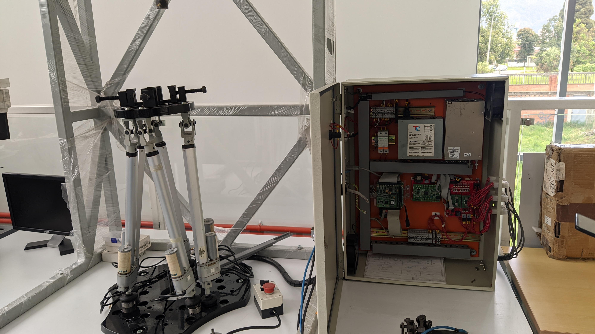
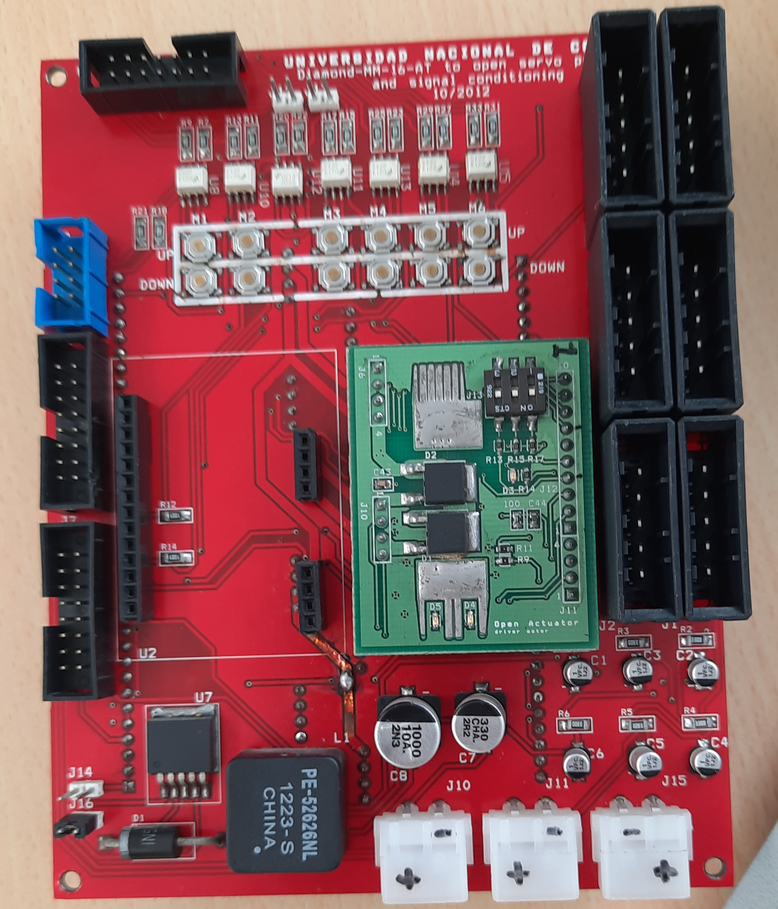
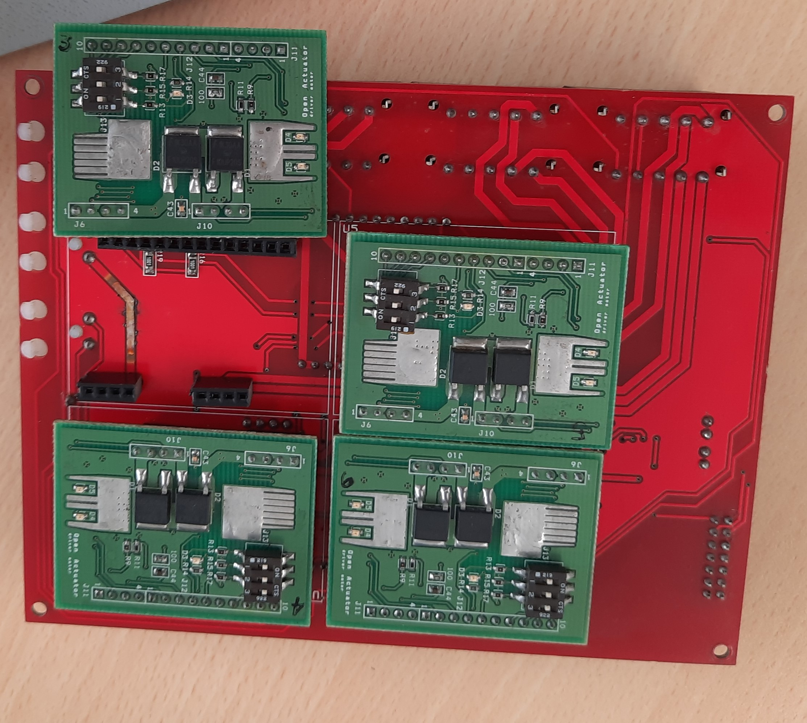
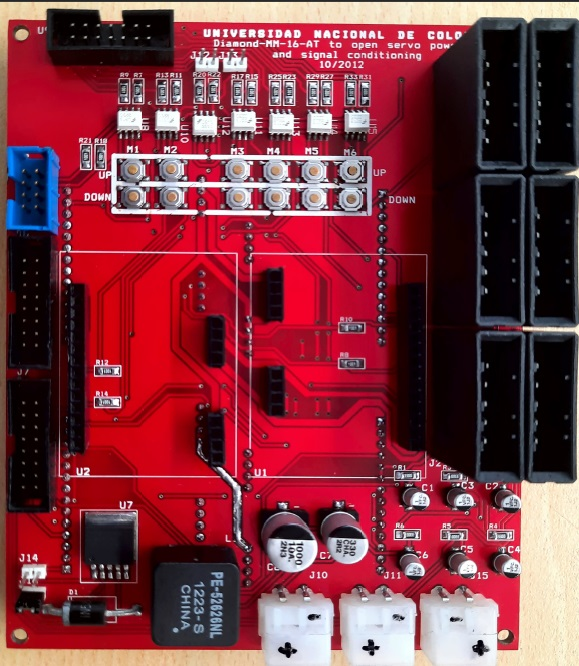
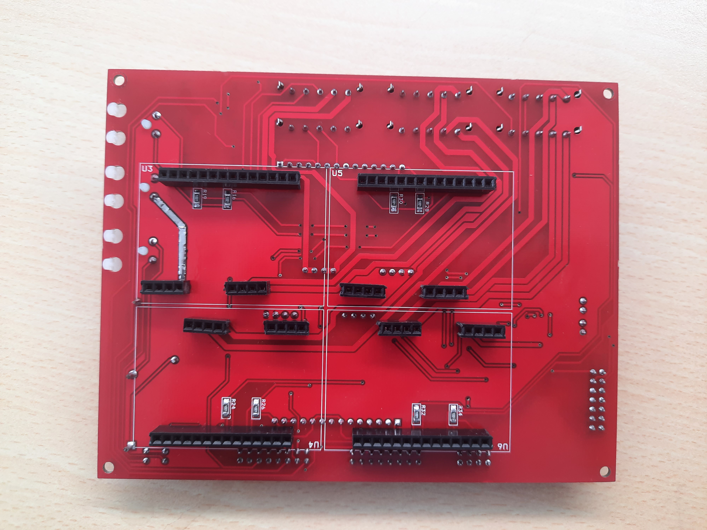

# Stewart Gough platform upkeep project 

This repo documents the diagnostic and maintenance process of the PRISMMATIC platform (Parallel Robot Interface for Simulation of Machining Multi-Axis Trajectories and Integral Control), an Stewart Gough platform at Universidad Nacional de Colombia. This work is done as part of the final project of the class _Sensors and Actuators_ Semester 2021-II. 




## Table of contents

* [Process](#process)
* [Inquires](#inquiries) 
* [Information about legacy system](#information-about-legacy-system)
* [Components](#components)
* [References and resources](#references-and-resources)

## (Tentative) Objectives
### Main Objective
The main objective of this work is to upkeep and bring back to service the inactive PRISMMATIC platform. Recovering this asset in the mechatronic's laboratory  can proof to be a  useful platform  for current and future students to work with parallel robots. 

### Secondary objectives
The project has the following secondary objectives:
* Document the  diagnostic and maintenance process
* Update the platform and make it's system requirements compatible with a modern system (Windows 10 - MATLAB r2021a). 
* Moving the platform using open source software (Python 3.7 or higher).
* Evaluate the impact of sensor quality on the performance of the system.


## Process

### Getting to know the system
The process started by getting acquaintance with the platform. After an onsite visit of the platform, the team received the corresponding documentation and produced a [file](project_structure.txt) containing a log with every one of the files received.

```
tree /f > project_structure.txt
```
> Note: the previous terminal command  produces the log file, it is encoded in windows 1252 encoding format

This analysis proof fruitful and provided a starting path '/Software' to begin the search.


#### search of xPC usage
To find out how and where the xPC toolbox was used, instances of the XPCTarget toolbox were searched for in the 'Software\GUI_V3' folder. The matches found were logged in the [xpcMatch](xpcMatch.txt) file.

```
findstr /i /n /s "xpc" *.m > xpcMatch.txt
```

grep -r -n  --include=\*.m 'xpc' './ENTREGA-FINAL-RC-380-2011/CONTROLADORES/PRISMMATIC/cd' > ../xpcMatch.txt


Subsystem5

This information allow us to understand how and where the deprecated _xPC Target_  library was used, identifying './GUI_V3/BuildXPC.m:15:tgPC104 = xpctarget.xpc' as a starting point to understand the code. 


### Software setup
With an idea in mind on how the code worked. The following step consisted on setting up an environment for running it. The procedure started by following the instructions indicated in the [user manual](doc/User_Manual_StewartGoughV1_3.pdf). The legacy system requirements (MATLAB R2011a and XPCTarget toolbox) were analyzed in order to find a modern compatible setup. The xPCTarget toolbox was discontinued in MATLAB R2018a, and replaced by the __Real Time toolbox__ \[[1](#references-and-resources)\]. However this system only supports __Speedgoat__ hardware which made it incompatible for the applications with it's [components](#components).  


Therefore  MATLAB r2011a (Version 7.12 ), xPC target (Version 5.0) and simulink (Version 7.7) were setup on a modern computer, which can be found at [Matlab 2011a release ](https://www.mathworks.com/downloads/?release=R2011a).
> Information gathered thanks to the MATLAB command ```ver``` 


#### Installation of drivers and programs

In order for the platform's communication card, to be able to connect with xPCTarget, it is necessary than the drivers from the '\Software\thirdpartydrivers' folder will be added to the toolbox drivers folder. Additionally, the 'Software\Stewart_Gough_library' library needs to be added to the MATLAB path.


In order to program the microcontroller it is necessary to install a C compiler. Testing with several compilers we found that the version of MATLAB used only recognizes the compilers installed by __Visual Studio 2010 Professional__ (recommended software in the original documentation), this version of Visual Studio was difficult to find as an online installation did not work since Microsoft servers are unavailable, therefore, it was necessary to look for the version in the iso file (packaged with all the files necessary for installation). This program was found at the following [link](https://51-68-135-147.xyz/Getintopc.com/Visual_Studio2010_Professional_x86_x16-81637.iso?md5=m66_WqpIkGd_2yU8rFLZyg&expires=1645586596).

Once the C compiler was installed, MATLAB recognized it and proceeded with the network configuration of the card.

```
tgs = xpctarget.targets;
tgs.makeDefault('TargetPC1');
env.TargetBoot = 'DOSLoader';
env.TcpIpTargetAddress = '192.168.1.12';
env.TcpIpSubNetMask = '255.255.255.0';
```

The next step is to set the IP address of the host PC to 192.168.1.13 with subnet mask 255.255.255.0. Finally, to move the platform, run the *GUI_V3.m* file from the 'Software\GUI_V3' folder.


### Testing the connection
When the first connection to the platform was attempted in the lab, the code returned several errors. The first one was "wrong IP address" and the xpctarget.xpc object could not be created in MATLAB; reviewing the documentation we found that the definition ```tg =   xpctarget.xpc()``` produced an error if a default target had not been specified, so the following command explicitly starting the settings of the target was used:

```
tg =   xpctarget.xpc('TCPIP','192.168.1.12','22222')
```

With this command the connection was established and then the GUI was executed, but it produced the error "application not loaded", and therefore, we decided to investigate in the BuildXPC.m file where a little more information was found.

Two useful commands we found to handle the connection to the target were
```
tg.targetping
tg.Application
```
The first shows us if the host pc and the target are on the same network without the need to check from CMD; and the second shows us which application is loaded on the target.

Finally, with the connection established it was possible to load the application that was in the BuildXPC.m file and connect the GUI with the target.


```
tg.load('Code2XPCtarget\GUI_User_V1_3')
tg.start
```


### Platform troubleshooting
<!-- 
ambos LEDS amarillos prendidos en Driver = PELIGOR!!! RIESGO DE QUE SE QUEME LA PLACA

-->


| PC104 to STM32F4 Board | Top view | Bottom view |
| :------- | :----: | :----: |
| Received |  |  |  
| Repaired |  |  |  


## Inquiries 

* Software license the project is licensed under.
* History, participants and their contributions.
* Components and system architecture.
* Is Matlab 2017a compatible? 

<!-- Hoja de ruta -->


## Information about legacy system 

### System requirements
* Matlab 2011a 
*  __xPC Target (deprecated)__: Mathworks  toolbox for real time model  HIL (Hardware in the Loop) simulation.  produces __.dlm__ files. [1](#references-and-resources)


### Components:
#### Generic:
* Single board computer (SBC) PCM-4153.
* Diamond MM 16-AT.
* STM32F407 microcontroller.

#### Costum made


### (work in progress) Parties involved 
* Edgar Bolivar
* DIMAUN (Grupo de Trabajo en Nuevas Tecnologías Diseño, Manufactura y Automatización)

## References and Resources

1. [Forum xPC question](https://www.mathworks.com/matlabcentral/answers/479843-about-xpc-target-and-supproted-ioboard).
2. [MATLAB real time/xPC successor](https://www.mathworks.com/products/simulink-real-time.html?s_tid=FX_PR_info).
3. [Real time MATLAB laboratory](http://tsakalis.faculty.asu.edu/coursea/481LAB2015.pdf).
4. Frank González-Morphy (2022). [xPC Target Quick Reference Guide](https://www.mathworks.com/matlabcentral/fileexchange/6414-xpc-target-quick-reference-guide), MATLAB Central File Exchange. Retrieved January 23, 2022. 
5. [xPC target User guide Version 2](http://www.bmed.mcgill.ca/reklab/manual/common/xpc/documentation/xpc_target_ug%5B1%5D.pdf). Retrieved January 23, 2022.
6. [MATLAB Real time documentation](https://www.mathworks.com/help/pdf_doc/slrealtime/index.html).
7. [STM32 Microcontroller Support ](https://www.mathworks.com/products/hardware/stmicroelectronics.html)
8. [Matlab 2011a release ](https://www.mathworks.com/downloads/?release=R2011a) 


