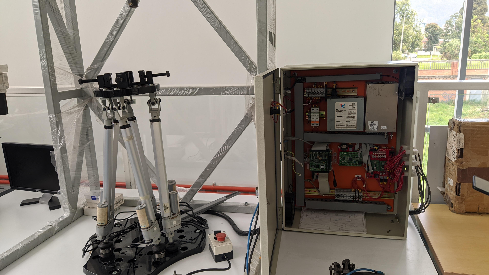

# Stewart Gough platform

This repo documents the ... process of the PRISMMATIC platform (Parallel Robot Interface for Simulation of Machining Multi-Axis Trajectories and Integral Control), an Stewart Gough platform at Universidad Nacional de Colombia. 

## Table of contents

* [Process](#process)
* [Inquires](#inquiries) 
* [Information about legacy system](#information-about-legacy-system)
* [Components](#components)
* [References and resources](#references-and-resources)

## Objectives
### Primary Objective
The main objective of this work is to perform a motion interface with MATLAB R2011a for the SG platform in order to be a useful platform for current and future students to work with parallel robots. 

### Secondary objectives
The project has the following secondary objectives:
* Document 

## Process

## CAD Model
In order to better understand the operation of the platform and have the parts modeled in an open source CAD program, the model was made in OnShape, a Software-as-a-Service (SaaS) product development platform that combines CAD, built-in data management, real-time collaboration tools, and business analytics[9](#references-and-resources).

    <a href="https://cad.onshape.com/documents/0fb14dbddb7adb0e8dacd4ba/w/41542f3fda26bca8164b05d2/e/ca1944bdd5da46a1797ada5e?configuration=default&renderMode=0&uiState=61f9581f168a0f2540c61bf6" target="_blank">
          
        Onshape CAD Model
    </a>

This model was built based on the design plans of Francisco Villate and the models found in the catalogs of commercial parts.

## Information about legacy system 

### System requirements
* Matlab 2011a 
* __xPC Target (deprecated)__: Mathworks toolbox for real time model HIL (Hardware in the Loop) simulation. produces __.dlm__ files. [1](#references-and-resources)

### (work in progress) Parties involved 
* Daniel Andres Ramirez Rodriguez 
* Edgar Bolivar
* Francisco Javier Villate Gaona
* Luis Miguel Mendez - Academic supervisor 
* Jorge Sofrony - Academic supervisor
* Juan David Muñoz 
* Juan Diego Galeano 
* Ubaldo Gracia Zaragoza
* Juan David Ramirez
* Jorge Andrés Acero - Laboratory Technician
* DIMAUN (Grupo de Trabajo en Nuevas Tecnologías Diseño, Manufactura y Automatización)

## Components:

    

The previos diagram the relation between the subsystems and their interaction in the control loop.

<table style="width:80%">
<caption>Components </caption> 

<tr>
    <th> Component type </th>
    <th> Generic </th>
    <th> Custom made </th>
</tr>

<tr> <th>Electronic </th>
    <th><ul>         
        <li> Single board computer (SBC) PCM-4153.  </li>
        <li> PC104 expansion card Diamond MM 16-AT. </li>
        <li> STM32F407 microcontroller.             </li>
    </ul></th>
    <th><ul>
        <li> PC104 to STM32F4 board.</li>
        <li> STM32F4 Baseboard.     </li>
    </ul></th>    
</tr>

<tr> <th>Mechanical</th>
    <th><ul>
        <li> Actuators Firgelli Automation FA-PO-35-12-12". </li>
        <li> Spherical Joints Hephaist SRJ012C.             </li>
    </ul></th>
    <th><ul>
        <li> Base plate.       </li>
        <li> Mobile plate.     </li>
        <li> Manual press.     </li>
        <li> Universal joints. </li>           
    </ul></th>
</tr>

<tr> <th>Software </th>
    <th><ul>            
        <li> STM32F4 OS real time: ChibiOS/RT</li> 
    </ul></th>
    <th><ul>
        <li> XPC third party drivers </li>
        <li> Stewart_Gough_library   </li>
    </ul></th>
</tr>
</table>

<!-- add links to libraries -->

## Contributors
* Alexandra - Laboratory Technician
* Jorge Andrés Acero - Laboratory Technician
* Alvaro William Roa Gutierrez- Laboratory Technician

## References and Resources

1. [Forum xPC question](https://www.mathworks.com/matlabcentral/answers/479843-about-xpc-target-and-supproted-ioboard).
2. [MATLAB real time/xPC successor](https://www.mathworks.com/products/simulink-real-time.html?s_tid=FX_PR_info).
3. [Real time MATLAB laboratory](http://tsakalis.faculty.asu.edu/coursea/481LAB2015.pdf).
4. Frank González-Morphy (2022). [xPC Target Quick Reference Guide](https://www.mathworks.com/matlabcentral/fileexchange/6414-xpc-target-quick-reference-guide), MATLAB Central File Exchange. Retrieved January 23, 2022. 
5. [xPC target User guide Version 2](http://www.bmed.mcgill.ca/reklab/manual/common/xpc/documentation/xpc_target_ug%5B1%5D.pdf). Retrieved January 23, 2022.
6. [MATLAB Real time documentation](https://www.mathworks.com/help/pdf_doc/slrealtime/index.html).
7. [STM32 Microcontroller Support ](https://www.mathworks.com/products/hardware/stmicroelectronics.html)
8. [Matlab 2011a release](https://www.mathworks.com/downloads/?release=R2011a) 
9. [Onshape home page](https://www.onshape.com/en/)
10. Ramírez Rodríguez, D. (2010). Diseño de una plataforma robótica paralela de 6 dof para asistente quirúrgico en cirugías de reconstrucción cráneo-facial. \[[online](https://repositorio.unal.edu.co/handle/unal/6931)\]
11. Villate Gaona, F. (2015). Diseño y construcción de prototipo para mecanizado multiejes en materiales blandos utilizando arquitectura paralela Stewart-Gough. \[[online](https://repositorio.unal.edu.co/handle/unal/55527)\]
12. [Stewart Gough videos](https://youtube.com/playlist?list=PL1-Z9ArJBD7uetQ7_8bsNCHkSw-kKsfF8)
13. [Google drive's extended documentation folder](https://drive.google.com/drive/folders/1fW6-u03ogQynEGwKbBM8Ii7BDrmoT2iq?usp=sharing)

