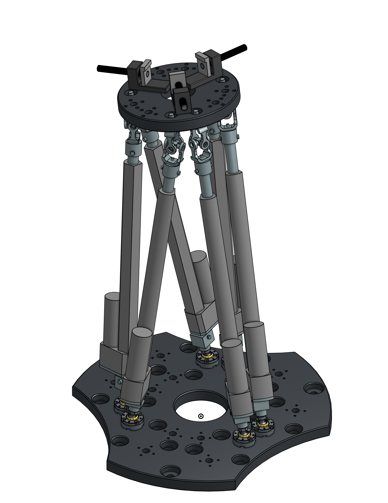

# Stewart Gough platform

This repo documents the diagnostic and maintenance process of the PRISMMATIC platform (Parallel Robot Interface for Simulation of Machining Multi-Axis Trajectories and Integral Control), an Stewart Gough platform at Universidad Nacional de Colombia.

## Table of contents

* ...

## Objectives
### Primary Objective
The main objective ...

### Secondary objectives
The project has the following secondary objectives:
* ...

## CAD Model
In order to better understand the operation of the platform and have the parts modeled in an open source CAD program, the model was made in OnShape, a Software-as-a-Service (SaaS) product development platform that combines CAD, built-in data management, real-time collaboration tools, and business analytics[9](#references-and-resources).

    <a href="https://cad.onshape.com/documents/0fb14dbddb7adb0e8dacd4ba/w/41542f3fda26bca8164b05d2/e/ca1944bdd5da46a1797ada5e?configuration=default&renderMode=0&uiState=61f9581f168a0f2540c61bf6" target="_blank">
          
        Onshape CAD Model
    </a>

This model was built based on the design plans of Francisco Villate and the models found in the catalogs of commercial parts.

## Components:

<!-- 

    

The previos diagram the relation between the subsystems and their interaction in the control loop.

<table style="width:80%">
<caption>Components </caption> 

<tr>
    <th> Component type </th>
    <th> Generic </th>
    <th> Costum made </th>
</tr>

<tr> <th>Electronic </th>
    <th><ul>         
        <li> Single board computer (SBC) PCM-4153.  </li>
        <li> PC104 expansion card Diamond MM 16-AT. </li>
        <li> STM32F407 microcontroller.             </li>
    </ul></th>
    <th><ul>
        <li> PC104 to STM32F4 board.</li>
        <li> STM32F4 Baseboard.     </li>
    </ul></th>    
</tr>

<tr> <th>Mechanical</th>
    <th><ul>
        <li> Actuators Firgelli Automation FA-PO-35-12-12". </li>
        <li> Spherical Joints Hephaist SRJ012C.             </li>
    </ul></th>
    <th><ul>
        <li> Base plate.       </li>
        <li> Mobile plate.     </li>
        <li> Manual press.     </li>
        <li> Universal joints. </li>           
    </ul></th>
</tr>

<tr> <th>Software </th>
    <th><ul>            
        <li> STM32F4 OS real time: ChibiOS/RT</li> 
    </ul></th>
    <th><ul>
        <li> XPC third party drivers </li>
        <li> Stewart_Gough_library   </li>
    </ul></th>
</tr>
</table> -->

## Contributors
* Alexandra Ocampo - Laboratory Technician
* Jorge Andrés Acero - Laboratory Technician
* <a href="mailto:awroag@unal.edu.co">Alvaro William Roa Gutierrez</a> - Laboratory Technician

## References and Resources

1. 

